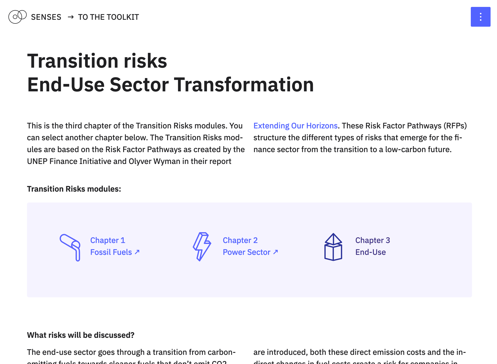

# Enduse Sector Risks Module

This repository contains the code for [*Transition Risks – Enduse Sector Transformation*](https://climatescenarios.org/end-use), a learn module on finance risks related to transitions in the Enduse sector. It is part of the [SENSES Toolkit](https://climatescenarios.org/).



## License

The source code is licensed under the [ISC license](LICENSE.md). Text and graphics are licensed under [Attribution-ShareAlike 4.0 International](https://creativecommons.org/licenses/by-sa/4.0/). For licensing information on datasets please refer to the data sources section. Exceptions are listed below on a per-file basis.

## Data Sources

Data sources and if applicable licenses are listed below:

- `*/EndEnergyAndCosts.csv` `*/FinalEnergy.csv` `*/Investments.csv` `*/Revenue.csv`: [CD-LINKS Scenario and Data hosted by IIASA]( https://data.ene.iiasa.ac.at/cd-links/); [Licence for the CD-LINKS scenario ensemble data](https://data.ene.iiasa.ac.at/cd-links/#/license)

## Development

## Project setup
```
npm install
```

### Compiles and hot-reloads for development
```
npm run serve
```

### Compiles and minifies for production
```
npm run build
```

### Lints and fixes files
```
npm run lint
```

### Customize configuration
See [Configuration Reference](https://cli.vuejs.org/config/).
